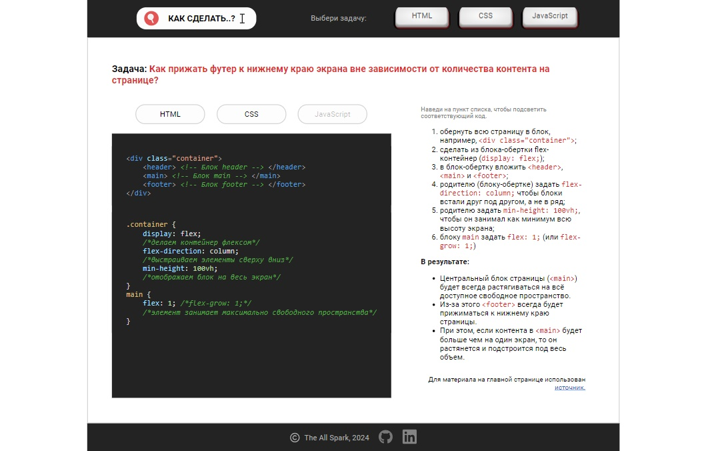

# Workbook - как решить задачу с использованием HTML, CSS и JS (HTML | CSS | JS)

[Переключиться на английский | Switch to English](./readme.md)

## О проекте
Сайт представляет собой сборник материалов с конкретными задачами с сфере разработки сайтов, их решением и объяснением решения (алгоритмом); своеобразный личный конспект. На каждую задачу отводится отдельная страница.  
Со временем будет дополняться новыми материалами.

**Инструменты:** 

**Языки:** 
 
 
 

**Демо:** [Перейти на главную страницу сайта -->](https://the-all-spark.github.io/workbook/) 

## Страницы (реализованные задачи) и демо

#### 1. Как прижать футер к нижнему краю экрана вне зависимости от количества контента на странице?

[Перейти на главную страницу сайта -->](https://the-all-spark.github.io/workbook/) 

#### 2. Как переключиться на другой язык страницы?

[Перейти на страницу (JS) -->](https://the-all-spark.github.io/workbook/switch_lang.html) 

## Реализованный функционал

### Общий для всех страниц:
1. верстка общих для всех страниц _header-а_ (с главным меню) и _footer-а_ (с контактами), а также шаблона основного блока страниц (с формулировкой задачи, кнопками стека, блоками для кода и его пояснения) (HTML, CSS);
2. стилизация кнопок главного меню (CSS);
3. стилизация кнопок-ссылок в footer-е (CSS);
4. стилизация отображенного кода-решения задачи (подключена библиотека hightlight.js);
5. выделение соответствующего кода при клике на кнопку стека (HTML, CSS, JavaScript). Если код отсутствует, кнопка неактивна. Если был сделан клик вне кнопки стека, все выделения будут отменены (JS);
6. подчеркивание строки алгоритма выполнения и соответствующего ей фрагмента кода при наведении на строку в блоке пояснения. При уходе курсора со строки выделения удаляются (JS).

### Дополнительный функционал:

**Страница переключения между языками**:
- отображение текста на русском языке при клике на кнопку "RU" или английском при клике на кнопку "EN" (JS);
- выбор пользователем языка по умолчанию (для первоначального отображения текста) (JS). Функционал представлен в codepen по [ссылке](https://codepen.io/Lisovolk/pen/ExzLqjJ).