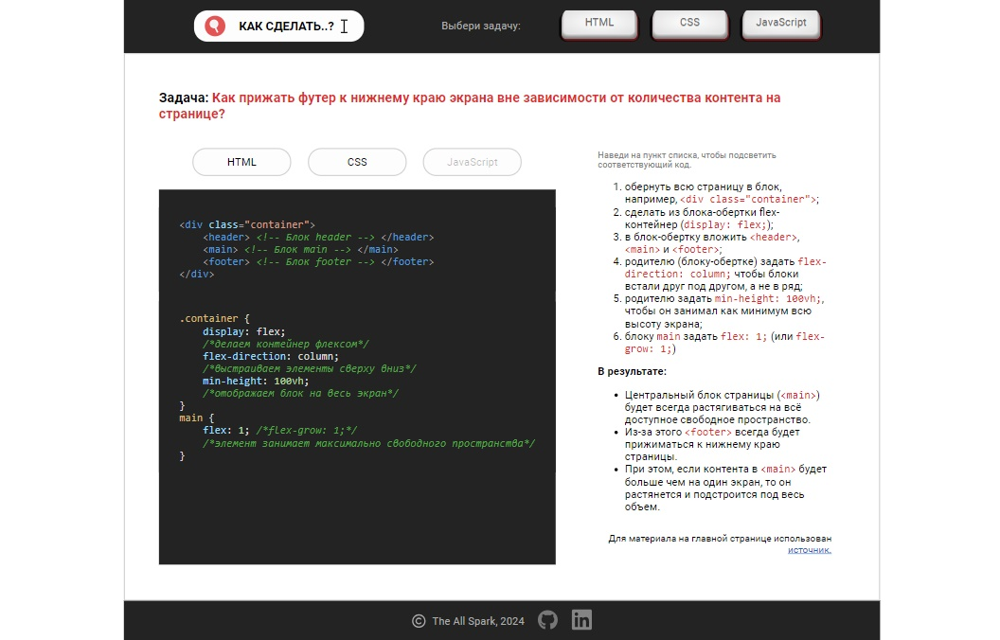
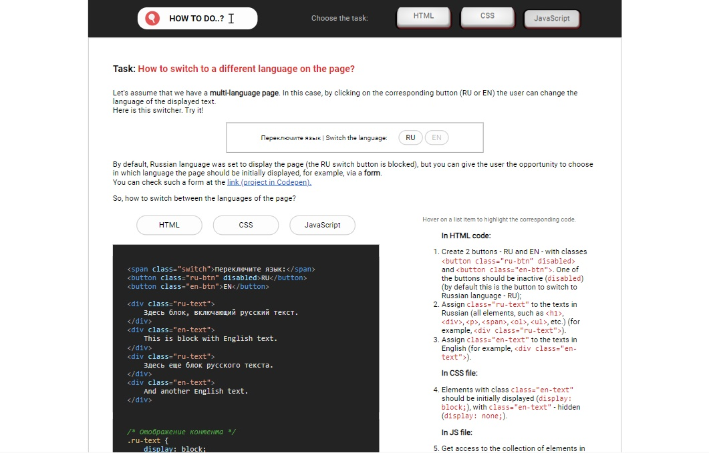

# Workbook - how to solve the task with usage of HTML, CSS & JS (HTML | CSS | JS)

[Switch to Russian | Переключиться на русский](./readme-ru.md)

## About the project
The site is dedicated to the collection of materials with specific tasks in the field of web development, their solution and explanation of the solution (algorithm); some kind of personal notes. A separate page is assigned for each task.  
Site will be supplemented with new materials.

**Tools:** 

**Stack:** 
 
 
 

**Demo:** [to the main page -->](https://the-all-spark.github.io/workbook/) 

## Pages (realized tasks) and demo

#### 1. How to pin the footer to the bottom edge of the screen regardless of the content  amount on the page?

[Go to the main page -->](https://the-all-spark.github.io/workbook/)    

#### 2. How to switch to a different language on the page?

[Go to the task page (JS) -->](https://the-all-spark.github.io/workbook/switch_lang.html)    

## Realized functionality

### Common to all pages
1. HTML and CSS code, common for all pages: the _header_ (with main menu) and the _footer_ (with contact information), as well as the template of the main block of pages (with task statement, stack buttons, blocks for code and its explanation) (HTML, CSS);
2. styling of main menu buttons (CSS);
3. styling of buttons and links in footer (CSS);
4. styling of the displayed code-solution of the task (the hightlight.js library is connected);
5. marking of the corresponding code when clicking on a stack button (HTML, CSS, JavaScript). If the code is not present, the button is inactive. If a click is made outside the stack button, all previous marking will be canceled (JS);
6. underlining of the line and the corresponding code fragment when hovering over the line in the explanation block. When the cursor leaves the underline line, all marks are deleted (JS);
7. adaptive code (CSS).

### Additional functionality

**Page for switching between languages**:
- displaying of the text in Russian when clicking on the "RU" button or in English when clicking on the "EN" button (JS);
- the opportunity for users to select a default language (for initial display of text) (JS). The functionality is presented in codepen in the [link](https://codepen.io/Lisovolk/pen/ExzLqjJ).